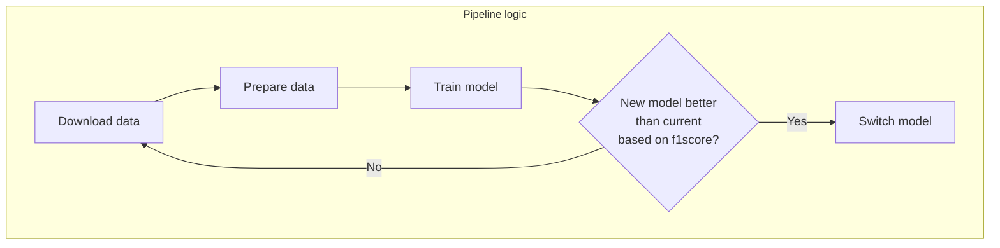

# dp--mlops-project-template

## Логика пайплайна

```mermaid
%%{init: {'theme':'default'}}%%
  graph TD;
      
    subgraph N[Pipeline logic]
    %%subgraph O
      A[Download data]-->B[Prepare data];
      B-->C[Train model];
      C-->D{New model better<br/> than current<br/> based on f1score?}
      D-->|Yes| E[Switch model];
      D-->|No| A;
    end
    %%end
    
    classDef title font-size:14px
    classDef padding stroke:none,fill:none

    class N title
    class NN title
    class O padding
    class OO padding
    
```

## Пайплайн KubeFlow с передачей данных между шагами

